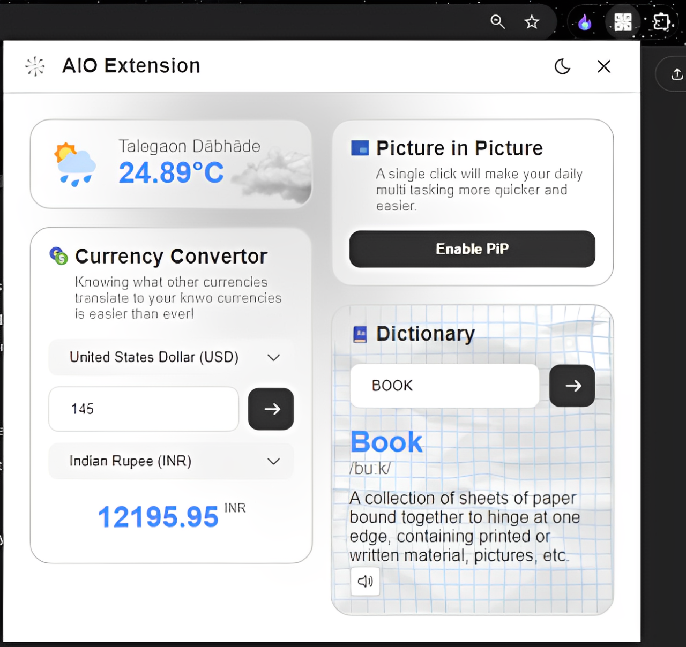

# 🛠️ **Multi-Purpose Chrome Extension**  

An all-in-one Chrome extension combining ad-blocking, PiP, weather updates, currency exchange, and more. Say goodbye to a cluttered taskbar and hello to seamless browsing!

---

## 🌟 **Features**
- **Ad-Blocker**: Remove annoying ads effortlessly. (Works on Youtube, Spotify, all types of Banner Ads across websites, etc.)
- **Picture-in-Picture**: Watch videos in PiP mode. (Works on Youtube, All Video Streaming Platforms, G-Meets, etc.)
- **Weather Updates**: Get real-time weather for your location. (Current Weather at users Locations)
- **Currency Exchange**: Convert currencies in seconds. (Real-Time Currency Rates across the top 20 Economics' in the World)
- **Dictionary**: Look up word definitions and pronunciations.

---

## 🚀 **How to Install (Unpacked Extension)**

1. Clone or download the repository:
   ```bash
   git clone https://github.com/your-repo/NooBxtension.git
2. Open Chrome and navigate to:
   ```bash
    chrome://extensions/
4. Enable Developer mode (toggle at the top-right corner).
5. Click Load unpacked and select the cloned/downloaded folder.
6. Go to the 'popup.js' file and Enter the Weather and Currency API's Accordingly.
-The extension is now added to your browser! 🎉

---

## 🧑‍💻 **Technologies Used**
- **HTML, CSS, JavaScript**: Core technologies for extension development.
- **Chrome Extension API**: To integrate functionalities like PiP and Ad-Blocker.
- **OpenWeatherMap API**: For real-time weather updates.
- **ExchangeRate API**: For currency conversion.
- **Dictionary API**: To fetch word definitions and pronunciation.

---

## 📂 **Project Structure**
- **manifest.json**: Defines the extension's metadata and permissions.
- **popup.html**: The main UI of the extension.
- **popup.js**: Contains the logic for all features.
- **assets/**: Folder for icons and additional resources.

---

## 🛠️ **Future Enhancements**
1. **Window Resizer**: Resize browser windows based on user-defined dimensions.
2. **Language Translation**: Translate text or webpages in real time.
3. **Customizable Features**: Allow users to enable/disable specific features as needed.

---

## 💬 **Contact**
Feel free to reach out for any questions or contributions:

1. Prathamesh Rajendra Navale
- **Email**: [workwithprathamesh18@gmail.com](mailto:workwithprathamesh18@gmail.com)
- **GitHub**: [navalepratham18](https://github.com/navalepratham18)
- **LinkedIn**: [Prathamesh-Navale](https://linkedin.com/in/prathameshnavale18)

2. Aniruddha Kadam
- **Email**: [Aniruddhadroit@gmail.com](mailto:Aniruddhadroit@gmail.com)
- **GitHub**: [Anniruddha-Kadam-dev](https://github.com/Anniruddha-Kadam-dev)
- **LinkedIn**: [Aniruddha-Kadam](https://www.linkedin.com/in/aniruddha-kadam-098865289/)

---

## 👀 **Project Preview**

<div align="center">
    
  <h2 align="center">Multi-Purpose Chrome Extension</h2>
</div>

---

Made with ❤️ by the **NoobEngineers Team**.

 

 
